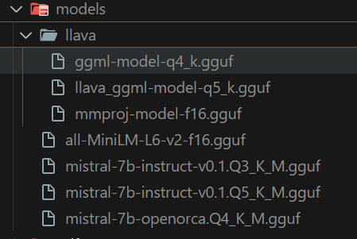

# ChatBot with LangChain - Audio, Image, and PDF Processing

Welcome to the **ChatBot with LangChain**! This project leverages **LangChain**, **OpenAI's Whisper**, and other advanced AI tools to build a versatile chatbot capable of understanding and processing text, audio, image, and PDF inputs. Ideal for users needing a flexible assistant for diverse content types. In this repository, I've created two chatbots for testing:

First Chatbot (chatPDF.py): This chatbot is designed specifically for querying PDFs and providing answers based on the document content.

Second Chatbot: This chatbot integrates three features: Audio Processing, Image Processing, and PDF Processing (explained below).

After testing, I've found that the first chatbot has a slower response speed compared to the second one.

## Table of Contents

- [Features](#features)
- [Setup and Installation](#setup-and-installation)
- [Usage](#usage)
- [File Structure](#file-structure)
- [Dependencies](#dependencies)

## Features

### 1. Audio Processing

- Transcribes audio files (e.g., `.wav`, `.mp3`) using **OpenAI Whisper**.

### 2. Image Processing

- Recognizes and extracts text from images using **OCR (Optical Character Recognition)**.
- Compatible with various image formats (e.g., `.jpg`, `.png`).
- Ideal for extracting information from documents, signs, or handwritten notes.

### 3. PDF Processing

- Processes multi-page PDFs, extracting text from each page.
- Splits large documents into manageable chunks for efficient searching and querying.

## Setup and Installation

To set up this project, please follow these steps:

1. **Install Python**

   Recommend Python <3.12 and >=3.9 (I use Python 3.9.6)

2. **Clone the repository**:
   ```shell
   git clone https://github.com/ngothuythanhtam/ChatBot_w_Langchain.git
   cd ChatBot_w_Langchain
   ```
3. **Create Virtual Environment**
   ```shell
   python -m venv ChatVenv
   ChatVenv/Scripts/activate
   ```
   Then, you need to install the requirement packages in setup.txt by runing command:
   ```shell
   pip install -r setup.txt
   ```

   If you want to install PyTorch with CUDA, check your cuda version first then find the compatibile PyTorch CUDA version. (I use CUDA 12.1)
   ```shell
   pip install torch torchvision torchaudio --index-url https://download.pytorch.org/whl/cu121
   ```
   [Click here for more infomation](https://gist.github.com/Hansimov/c2c82c9512245758398bc8b48c2789c0)

4. **Install Models** via   [HuggingFace](https://huggingface.co/)

    

## Usage

You can try to experience both of these chatbot

5. **Updating**

**Reference from some tutorials on Youtube**
